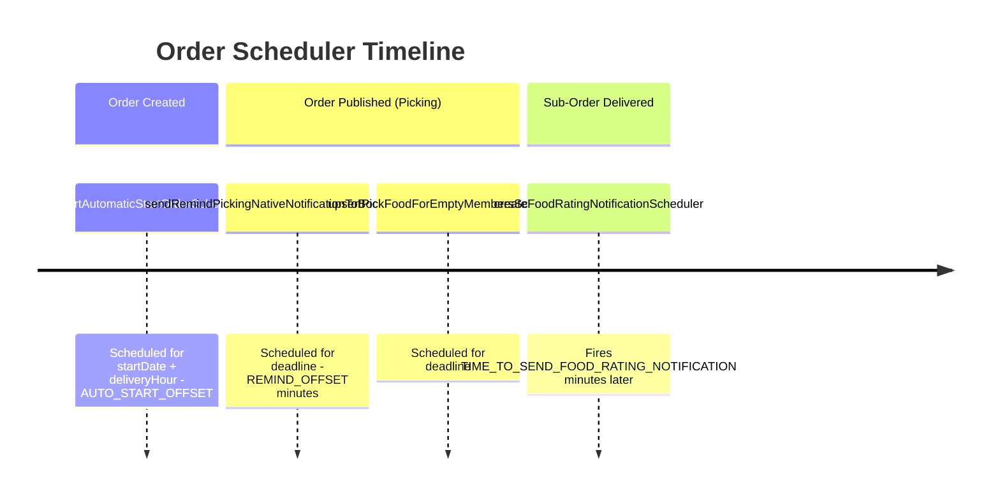

# Booker — Order Lifecycle (Post-Publish)

## Overview

After an order is published to `picking`, the lifecycle progresses through food selection, delivery, payment, and review. Bookers observe most of this — admin drives the transitions.

---

## Order States (Full Reference)

```
bookerDraft → pendingApproval → draft → picking → inProgress → pendingPayment → completed → reviewed
                                  │
                                  ▼
                          canceled / expiredStart / canceledByBooker
```

Defined across 3 TypeScript enums in `src/utils/enums.ts`:
- `EBookerOrderDraftStates` — `bookerDraft`
- `EOrderDraftStates` — `draft`, `pendingApproval`
- `EOrderStates` — `picking`, `inProgress`, `pendingPayment`, `completed`, `reviewed`, `canceled`, `canceledByBooker`, `expiredStart`

---

## Step 4: Participants Pick Food

Participants log in and select food for each delivery date during `picking` phase.

See `docs/roles/participant/food-selection.md` for full details.

Selections are stored in `plan.metadata.orderDetail[timestamp].memberOrders[userId]`.

---

## Step 5: Start Order (Point of No Return)

**Trigger:** Admin clicks "Start Order", or AWS EventBridge auto-start fires

**API:** `PUT /api/orders/:orderId/plan/:planId/start-order`

What happens:
1. Order state → `inProgress`
2. One Sharetribe transaction is created per delivery date (using sub-account trusted SDK)
3. `transactionId` written to `plan.metadata.orderDetail[timestamp].transactionId`
4. Firebase notifications sent to participants and restaurants

**This is irreversible.** Once transactions are initiated, the booking lifecycle is locked. See `docs/shared/transaction-flow.md`.

---

## Step 6: Initialize Payment Records

**Trigger:** Immediately after `start-order` completes

**API:** `POST /api/orders/:orderId/plan/:planId/initialize-payment`

Creates Firebase Firestore payment records (hidden from history until admin reviews):
- **Partner payments** — one per restaurant per delivery date
- **Client payment** — one for the full order

See `docs/roles/admin/payment-flow.md` for admin confirmation flow.

---

## Step 7: Sub-Order Delivery Lifecycle

Each delivery date goes through its own Sharetribe transaction. Admin drives all transitions via `POST /api/admin/plan/transit`.

High-level progression per sub-order:

```
initiated → partner-confirmed → delivering → completed → reviewed
          ↓                   ↓
      partner-rejected    failed-delivery
          ↓
        canceled
```

Booker receives Firebase and OneSignal notifications at each stage. See `docs/shared/transaction-flow.md` for all transitions.

---

## Step 8: Food Handover Checklist

When delivery is completed, a digital checklist is created:

**API:** `POST /api/orders/:orderId/checklist/:subOrderDate`

Captures food items handed over, client signature, and partner signature.

**API:** `PATCH /api/orders/:orderId/checklist/:subOrderDate/booker` — booker signs

Meal labels (thermal & A4) now display the participant's **group name** when available, with automatic font scaling:
- Without group name: `text-[2.6mm]` (thermal) / `text-[2.8mm]` (A4)
- With group name: `text-[2.2mm]` (thermal) / `text-[2.4mm]` (A4)

---

## Step 9: Order Completion and Payment

When all sub-orders complete delivery:
1. System checks if all sub-orders are done → order → `pendingPayment`
2. Booker receives `OrderIsPendingPayment` OneSignal notification
3. Admin confirms payments via the payment management portal
4. Once both partner and client payments are confirmed → order → `completed`

See `docs/roles/admin/payment-flow.md` for confirmation details.

---

## Step 10: Review

After completion:
1. Admin triggers `review-restaurant` transition on each completed transaction
2. Review posted via Sharetribe's `post-review-by-customer`
3. If not reviewed within 14 days → `expired-review-time` fires automatically
4. Admin can still review after expiry via `review-restaurant-after-expire-time`

---

## AWS EventBridge Scheduler Timeline



All schedulers use `Asia/Ho_Chi_Minh` timezone. Schedule expressions are `at(yyyy-MM-ddTHH:mm:ss)` in Vietnam local time.

---

## Key API Reference

| Method | Endpoint                                               | Action                                |
| ------ | ------------------------------------------------------ | ------------------------------------- |
| `POST` | `/api/orders`                                          | Create order                          |
| `GET`  | `/api/orders/:orderId`                                 | Fetch order                           |
| `PUT`  | `/api/orders/:orderId`                                 | Update order                          |
| `POST` | `/api/orders/:orderId/publish-order`                   | Transition to picking                 |
| `PUT`  | `/api/orders/:orderId/member-order`                    | Update participant food selection     |
| `PUT`  | `/api/orders/:orderId/plan/:planId/start-order`        | Start order (initiate transactions)   |
| `POST` | `/api/orders/:orderId/plan/:planId/initialize-payment` | Create payment records                |
| `POST` | `/api/orders/:orderId/quotation`                       | Create quotation                      |
| `POST` | `/api/admin/plan/transit`                              | Admin transition sub-order state      |
| `PUT`  | `/api/admin/listings/order/:orderId/update-state`      | Admin update order state              |
