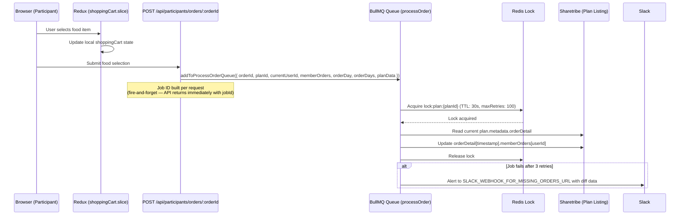

# Participant — Food Selection Flow

## Overview

During the `picking` phase, participants log in to choose their food for each delivery date. Because multiple participants can submit simultaneously, food selections go through a **BullMQ job queue with a Redis distributed lock** to prevent race conditions and data loss.

---

## Two Entry Points — Read This First

There are **two distinct food-selection write paths**, and they are not interchangeable:

| Caller                | Endpoint                                | Goes through BullMQ? | File                                                            |
| --------------------- | --------------------------------------- | -------------------- | --------------------------------------------------------------- |
| Participant (own pick) | `POST /api/participants/orders/:orderId` | **Yes** (`processOrder.job.ts`) | `src/pages/api/participants/orders/[orderId]/index.api.ts`     |
| Admin or booker (editing on someone's behalf) | `PUT /api/orders/:orderId/member-order` | **No — direct Sharetribe write** | `src/pages/api/orders/[orderId]/member-order/index.api.ts` |

The BullMQ + Redis lock protection only applies to participant self-pick. Admin/booker edits write straight to `plan.metadata.orderDetail` (no queue, no lock) and rely on the fact that admin/booker traffic is single-threaded per session. If you ever move bulk admin edits to a higher-concurrency path, route them through the queue.

> **Heads up:** `processMemberOrder.job.ts` exists as a newer implementation (uses `QueueEvents.waitUntilFinished` for synchronous results) but **has no callers** in the current code. `processOrder.job.ts` is the live path. Do not pick `processMemberOrder` in new code without wiring it in deliberately.

---

## Flow Diagram (Participant Self-Pick)



The API responds as soon as the job is enqueued — it does not wait for Sharetribe to confirm. Failures only surface via the Slack alert; the client sees `200 { jobId }` regardless.

---

## Key Components

### 1. Client-Side — Redux `shoppingCart` Slice

**File:** `src/redux/slices/shoppingCart.slice.ts`

```typescript
{
  [userId]: {
    [planId]: {
      [dayId (timestamp)]: CartItem
    }
  }
}
```

Updated optimistically as the user selects food. On submission, `updateMemberOrderApi` is called.

### 2. API Routes

**Participant self-pick (queued):** `POST /api/participants/orders/:orderId`
- File: `src/pages/api/participants/orders/[orderId]/index.api.ts`
- Calls `addToProcessOrderQueue(...)` — fire-and-forget, returns `{ jobId }` immediately
- Rule: **never** bypass the queue for participant-initiated writes

**Admin/booker edit (direct):** `PUT /api/orders/:orderId/member-order`
- File: `src/pages/api/orders/[orderId]/member-order/index.api.ts`
- Writes `plan.metadata.orderDetail` via `integrationSdk.listings.update` directly
- Triggers `mappingOrderDetailsToOrderAndTransaction` to sync transaction metadata
- When order is `inProgress` and `newMembersOrderValues` was passed, fires a `PARTICIPANT_GROUP_ORDER_FOOD_CHANGED` Slack notification

### 3. BullMQ Queue (`processOrder.job.ts`)

**Queue name:** `processOrder`
**Worker concurrency:** 5
**Retry:** 3 attempts, exponential backoff (base delay 2 000 ms)
**Stall threshold:** `stalledInterval: 30 000 ms`; `maxStalledCount: 1`
**Job retention:** `removeOnComplete: 10`, `removeOnFail: 5`

Two job files exist:

- `src/services/jobs/processOrder.job.ts` — **live** path; used by the participant self-pick endpoint
- `src/services/jobs/processMemberOrder.job.ts` — newer implementation (synchronous via `QueueEvents.waitUntilFinished`); **currently unused** — `addToProcessMemberOrderQueue` has zero call sites in the repo

### 4. Redis Distributed Lock

**Lock key:** `lock:plan:{planId}`
**TTL:** 30 seconds
**Max retries to acquire:** 100
**Retry backoff:** Exponential — `1.5^attempt × 100ms`

Implemented using **Redis Lua scripts** for atomicity:
- **Acquire:** `SET key token PX ttl NX`
- **Release:** Validates token before deleting (prevents removing another job's lock)

**Why this lock is critical:** Sharetribe doesn't support atomic partial updates — you must read the full `plan.metadata.orderDetail` object, modify it, and write it back. Without the lock, two concurrent jobs silently overwrite each other.

Lock is always released in `finally` block. If release fails, the 30s TTL auto-expires it.

### 5. Post-Release Verification

After lock release, the job re-fetches the plan and compares expected vs. actual data. A mismatch (another job overwrote) is captured in the diff.

### 6. Failure Alerting

Job failures after all retries send a Slack alert to `SLACK_WEBHOOK_FOR_MISSING_ORDERS_URL` with:
- `orderId`, `planId`, `userId`
- Food selection diff (expected vs. actual)
- BullMQ queue metrics
- Error details

This is the "missing orders" problem — food picks accepted by the API but not persisted.

---

## Participant Removal & orderDetail Cleanup

When a participant is deleted from an order (`DELETE /api/orders/[orderId]/participant`), their food selections are removed from all dates using:

**Utility:** `removeParticipantFromOrderDetail(orderDetail, participantId)` in `src/utils/order.ts`

```typescript
export type TOrderDetail = TPlan['orderDetail'];

export function removeParticipantFromOrderDetail(
  orderDetail: TOrderDetail,
  participantId: string,
): TOrderDetail {
  return Object.entries(orderDetail).reduce<TOrderDetail>((result, [date, dayDetail]) => {
    const memberOrders = dayDetail.memberOrders ?? {};
    return {
      ...result,
      [date]: { ...dayDetail, memberOrders: omit(memberOrders, participantId) },
    };
  }, {});
}
```

Flow:
1. Fetch current plan listing from Sharetribe
2. Call `removeParticipantFromOrderDetail(plan.metadata.orderDetail, participantId)`
3. Write cleaned `orderDetail` back to plan listing

---

## Auto-Pick Food Feature

If `order.metadata.isAutoPickFood === true`, an AWS EventBridge scheduler fires at the food selection deadline:

1. Lambda identifies participants with no selection
2. Auto-picks the default food for each empty slot
3. Updates `plan.metadata.orderDetail[timestamp].memberOrders[userId]` via Integration SDK

**Lambda:** `PICK_FOOD_FOR_EMPTY_MEMBER_LAMBDA_ARN`

---

## Data Storage

```
plan.metadata.orderDetail = {
  "1711929600000": {              // Unix timestamp in ms (delivery date)
    "restaurant": { id, name },
    "memberOrders": {
      "userId-123": {
        "foodId": "food-listing-id",
        "requirement": "No spicy"
      }
    },
    "transactionId": null,        // filled in after start-order
    "lastTransition": null
  }
}
```

---

## Food Price Display

Participants see the **final price** (`base + extraFee`) on each food card in `src/components/ListingCard/ListingCard.tsx`. The `extraFee` is read from `food.publicData.extraFee`. If the admin has not set a fee, the display falls back to `price.amount` only (since `extraFee` defaults to 0).

---

## Known Issues / Watch Points

1. **`maxRetries: 100`** in the Redis lock — marked `// Maybe bug here` in `processOrder.job.ts`. Reducing it risks failures under load, but the current value can stall the queue for ~minutes if a single plan is contended.

2. **`processMemberOrder.job.ts` is unused** — keep it in mind if you're picking a "newer/better" path; verify call sites before assuming it's wired.

3. **Job deduplication timing** — BullMQ job ID deduplication only works for jobs not yet started. If two submissions race and the first is already running, both may execute. The Redis lock handles write serialization in this case.

4. **Admin/booker edits bypass the queue** — see "Two Entry Points". Bulk edits or high-concurrency callers added later must be routed through `addToProcessOrderQueue` explicitly.
