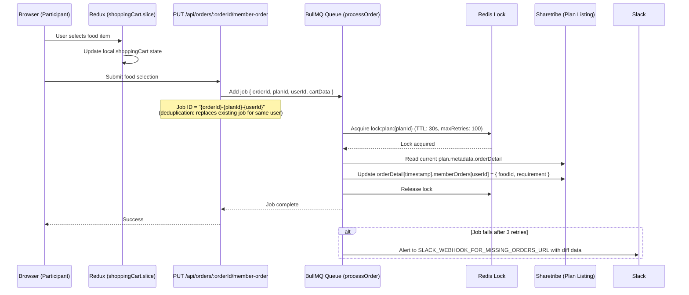

# Participant — Food Selection Flow

## Overview

During the `picking` phase, participants log in to choose their food for each delivery date. Because multiple participants can submit simultaneously, food selections go through a **BullMQ job queue with a Redis distributed lock** to prevent race conditions and data loss.

---

## Flow Diagram



---

## Key Components

### 1. Client-Side — Redux `shoppingCart` Slice

**File:** `src/redux/slices/shoppingCart.slice.ts`

```typescript
{
  [userId]: {
    [planId]: {
      [dayId (timestamp)]: CartItem
    }
  }
}
```

Updated optimistically as the user selects food. On submission, `updateMemberOrderApi` is called.

### 2. API Route

**File:** `src/pages/api/orders/[orderId]/member-order/index.api.ts`

- Validates the request
- Enqueues a BullMQ job with `jobId = {orderId}-{planId}-{userId}`
- The `jobId` deduplicates — if the user submits again before the previous job completes, the old job is replaced

**Rule:** Never write directly to Sharetribe from this endpoint. Always route through BullMQ.

### 3. BullMQ Queue

**Queue name:** `processOrder`
**Worker concurrency:** 5
**Retry:** 3 attempts, exponential backoff (2s, 4s, 8s)
**Stall threshold:** 30s; `maxStalledCount: 1`
**Job retention:** Last 10 completed, last 5 failed

Two near-identical job files:

- `src/services/jobs/processOrder.job.ts` — original async (fire-and-forget)
- `src/services/jobs/processMemberOrder.job.ts` — uses `QueueEvents.waitUntilFinished` for synchronous API response (newer, preferred)

### 4. Redis Distributed Lock

**Lock key:** `lock:plan:{planId}`
**TTL:** 30 seconds
**Max retries to acquire:** 100
**Retry backoff:** Exponential — `1.5^attempt × 100ms`

Implemented using **Redis Lua scripts** for atomicity:
- **Acquire:** `SET key token PX ttl NX`
- **Release:** Validates token before deleting (prevents removing another job's lock)

**Why this lock is critical:** Sharetribe doesn't support atomic partial updates — you must read the full `plan.metadata.orderDetail` object, modify it, and write it back. Without the lock, two concurrent jobs silently overwrite each other.

Lock is always released in `finally` block. If release fails, the 30s TTL auto-expires it.

### 5. Post-Release Verification

After lock release, the job re-fetches the plan and compares expected vs. actual data. A mismatch (another job overwrote) is captured in the diff.

### 6. Failure Alerting

Job failures after all retries send a Slack alert to `SLACK_WEBHOOK_FOR_MISSING_ORDERS_URL` with:
- `orderId`, `planId`, `userId`
- Food selection diff (expected vs. actual)
- BullMQ queue metrics
- Error details

This is the "missing orders" problem — food picks accepted by the API but not persisted.

---

## Participant Removal & orderDetail Cleanup

When a participant is deleted from an order (`DELETE /api/orders/[orderId]/participant`), their food selections are removed from all dates using:

**Utility:** `removeParticipantFromOrderDetail(orderDetail, participantId)` in `src/utils/order.ts`

```typescript
export type TOrderDetail = TPlan['orderDetail'];

export function removeParticipantFromOrderDetail(
  orderDetail: TOrderDetail,
  participantId: string,
): TOrderDetail {
  return Object.entries(orderDetail).reduce<TOrderDetail>((result, [date, dayDetail]) => {
    const memberOrders = dayDetail.memberOrders ?? {};
    return {
      ...result,
      [date]: { ...dayDetail, memberOrders: omit(memberOrders, participantId) },
    };
  }, {});
}
```

Flow:
1. Fetch current plan listing from Sharetribe
2. Call `removeParticipantFromOrderDetail(plan.metadata.orderDetail, participantId)`
3. Write cleaned `orderDetail` back to plan listing

---

## Auto-Pick Food Feature

If `order.metadata.isAutoPickFood === true`, an AWS EventBridge scheduler fires at the food selection deadline:

1. Lambda identifies participants with no selection
2. Auto-picks the default food for each empty slot
3. Updates `plan.metadata.orderDetail[timestamp].memberOrders[userId]` via Integration SDK

**Lambda:** `PICK_FOOD_FOR_EMPTY_MEMBER_LAMBDA_ARN`

---

## Data Storage

```
plan.metadata.orderDetail = {
  "1711929600000": {              // Unix timestamp in ms (delivery date)
    "restaurant": { id, name },
    "memberOrders": {
      "userId-123": {
        "foodId": "food-listing-id",
        "requirement": "No spicy"
      }
    },
    "transactionId": null,        // filled in after start-order
    "lastTransition": null
  }
}
```

---

## Known Issues / Watch Points

1. **`maxRetries: 100`** in the Redis lock — noted as potentially too high; reducing it risks failures under load, but it's intentional for now.

2. **Two job files** — `processOrder.job.ts` and `processMemberOrder.job.ts` are nearly identical. Check which is actually wired in `member-order/index.api.ts` before modifying either.

3. **Job deduplication timing** — BullMQ job ID deduplication only works for jobs not yet started. If two submissions race and the first is already running, both may execute. The Redis lock handles write serialization in this case.
