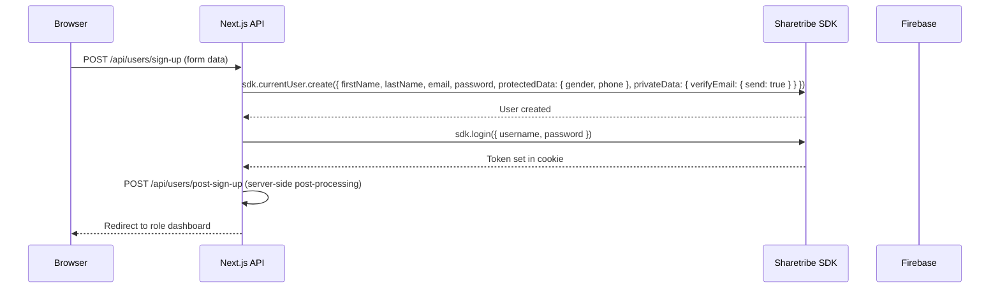
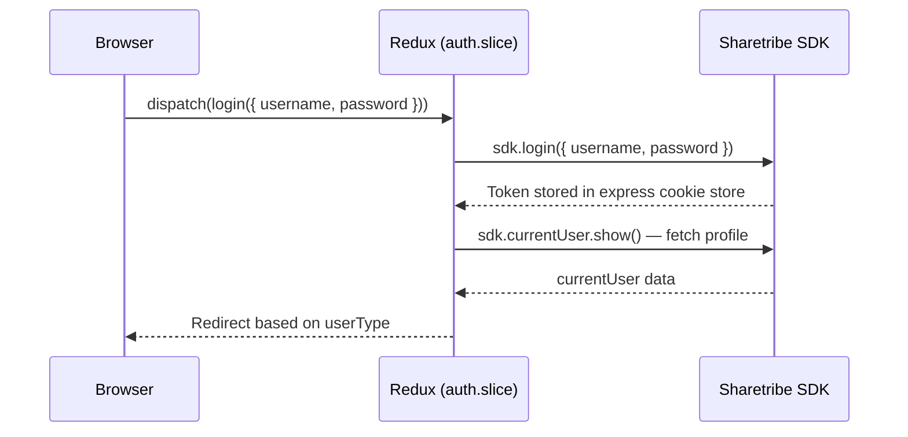

# Authentication Flow

## Overview

Authentication is entirely managed by **Sharetribe Flex SDK** using cookie-based token storage. There is no separate auth database — all user accounts live in Sharetribe.

## User Roles

Roles are determined by `currentUser.attributes.profile.publicData.userType`:

| Role                   | Value         | Portal           |
| ---------------------- | ------------- | ---------------- |
| Admin                  | `admin`       | `/admin/*`       |
| Booker (company)       | `booker`      | `/company/*`     |
| Participant (employee) | `participant` | `/participant/*` |
| Partner (restaurant)   | `partner`     | `/partner/*`     |

Company membership and permissions are stored separately in company listings (Sharetribe), not on the user directly.

---

## Sign-Up Flow



**Key details:**

- `protectedData` in Sharetribe stores gender and phone — visible to other users with SDK
- `privateData` is only visible to the user themselves and admins
- Email verification flag is set at account creation (`verifyEmail.send = true`)
- After sign-up, `postSignUpApi()` performs any server-side setup (e.g., company association)

---

## Login Flow



**Routes:**

- Vietnamese: `/dang-nhap`
- English: `/sign-in`

---

## Session Management (App Boot)

On every page load, `src/redux/slices/auth.slice.ts` runs `authInfo` thunk:

```
sdk.authInfo() → { isAnonymous: boolean, scopes: string[] }
```

- `isAnonymous: false` = authenticated user
- `isAnonymous: true` = no valid token (redirect to login)

The token is stored as an HTTP cookie managed by the Sharetribe SDK's `expressCookieStore`. It refreshes automatically.

---

## Logout Flow

1. Remove OneSignal device ID from `currentUser.privateData.oneSignalUserIds`
2. Call `Tracker.removeUser()` — clears Mixpanel identity
3. Call `sdk.logout()` — invalidates token, clears cookie
4. Redirect to sign-in page

---

## SDK Modes (Server-Side)

There are 4 primary SDK instances used in API routes:

| Function                              | File                             | Used For                                                               |
| ------------------------------------- | -------------------------------- | ---------------------------------------------------------------------- |
| `getSdk(req, res)`                    | `src/sharetribe/`                | Standard user-session operations (reads user's cookie token)           |
| `getTrustedSdk(req)`                  | `src/services/sdk.ts`            | Privileged operations (token exchange: user token → trusted token)     |
| `getIntegrationSdk()`                 | `src/services/integrationSdk.ts` | Admin operations without user context (uses integration client secret) |
| `getSubAccountTrustedSdk(subAccount)` | `src/services/subAccountSdk.ts`  | Initiates transactions as a company's sub-account user                 |

**Additional helper — `getTrustedSdkWithSubAccountToken(userToken)`** (`src/services/sdk.ts:116`):
This is a 5th helper, distinct from the 4 above. Instead of reading the token from the request cookie, it accepts an already-obtained `userToken` string directly (used when the sub-account login step has already been performed externally, e.g. in `subAccountSdk.ts`). It performs the same `exchangeToken()` flow as `getTrustedSdk` but without needing the `req` object. Developers touching the sub-account auth path should be aware both helpers exist.

### Sub-Account Pattern (Critical)

Each company has a dedicated Sharetribe user ("sub-account"). This is so that when transactions are created, the company is recorded as the Sharetribe "customer" role.

Flow for sub-account auth:

1. Company sub-account's password is stored AES-encrypted in `company.privateData.accountPassword`
2. `ENCRYPT_PASSWORD_SECRET_KEY` env var is used to decrypt it server-side
3. `sdk.login({ username, password })` is called with the decrypted password
4. The resulting token is exchanged for a trusted token via `sdk.exchangeToken()`
5. The trusted token can then call privileged transitions (e.g., `initiate-transaction`)

**Security note:** `ENCRYPT_PASSWORD_SECRET_KEY` must never be exposed. It protects all company sub-accounts.

---

## Route Guards

Defined in `src/paths.ts`:

| Array                            | Behavior                                                                       |
| -------------------------------- | ------------------------------------------------------------------------------ |
| `NonRequireAuthenticationRoutes` | Sign-in, sign-up, forgot/reset password pages — accessible without auth        |
| `IgnoredAuthCheckRoutes`         | Style guide, Sentry test page — auth check skipped entirely                    |
| `IgnoredPermissionCheckRoutes`   | QR code, invitation, email verification — auth required but role check skipped |

The middleware/`_app.tsx` checks auth state on each route change and redirects unauthenticated users to the appropriate login page based on their role.
