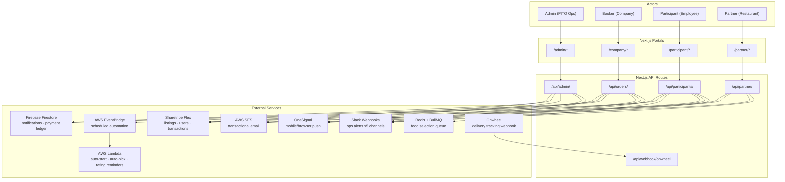
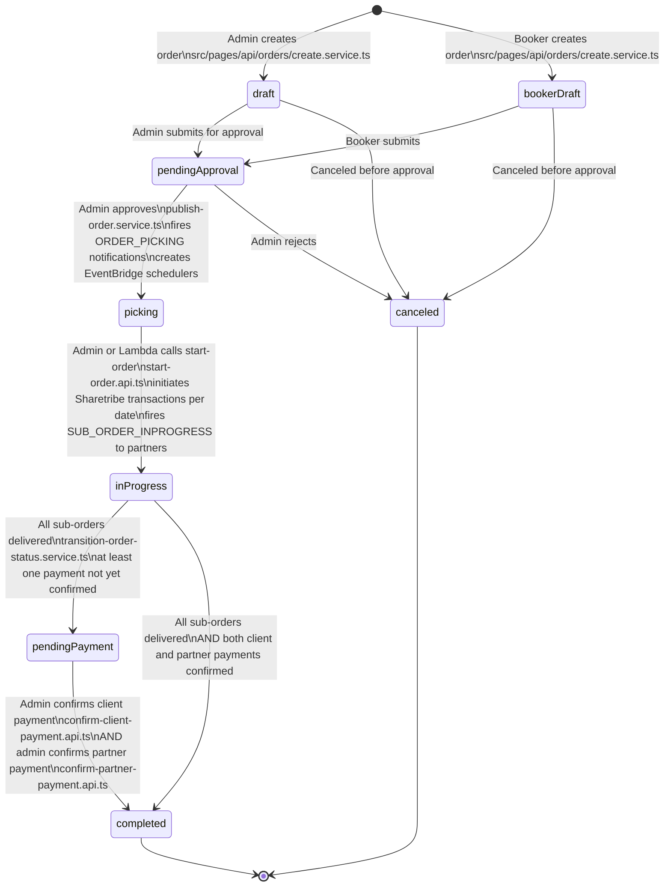
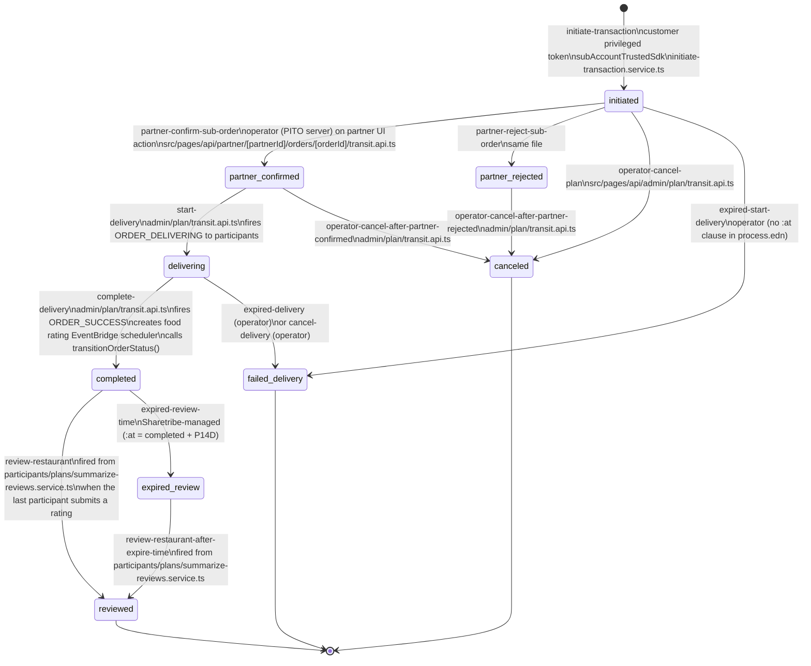
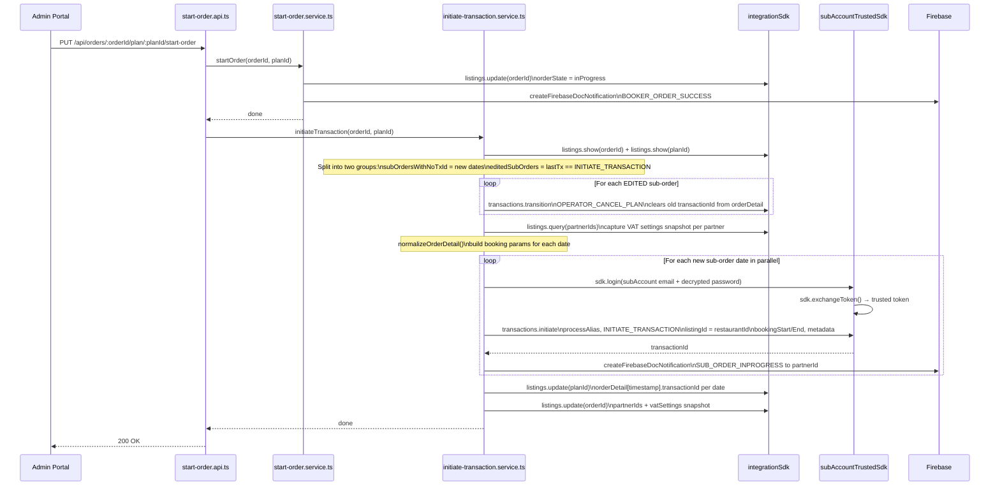
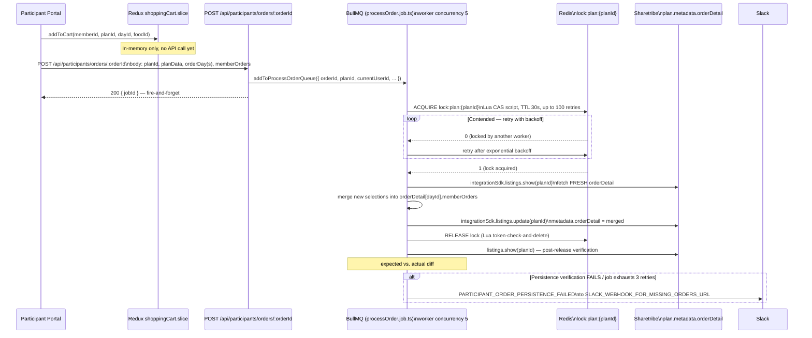
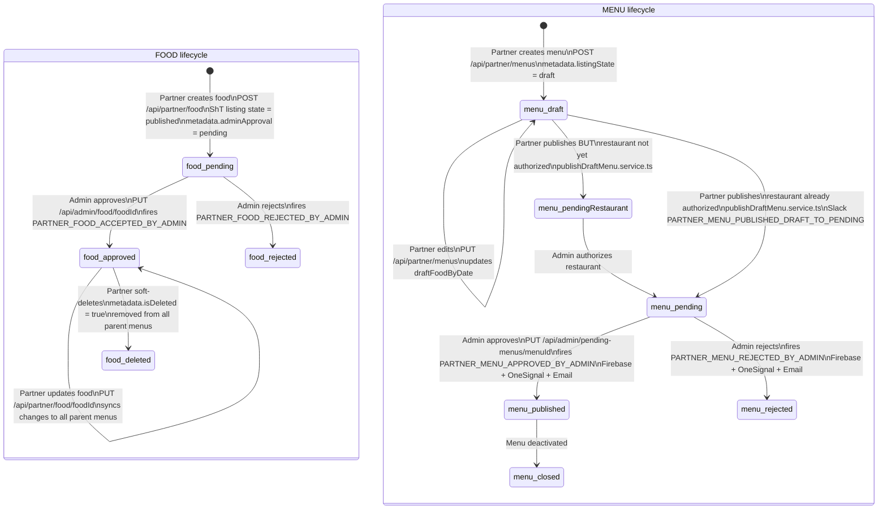
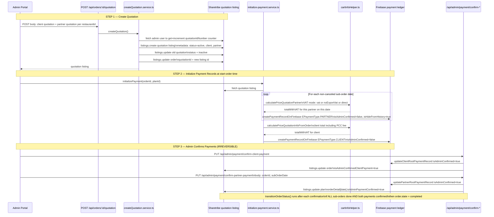
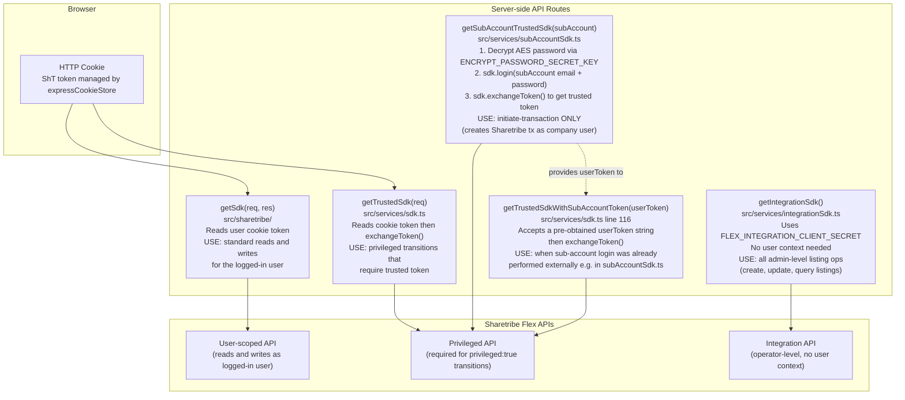
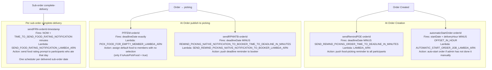

# Visual Workflow Maps

Mermaid diagrams for every major workflow in PITO Cloud Canteen, verified against source code.

> **Render tip:** GitHub, VS Code (Mermaid Preview extension), and Obsidian all render these natively.

---

## Contents

1. [System Context — All Actors & Services](#1-system-context--all-actors--services)
2. [Order Lifecycle State Machine](#2-order-lifecycle-state-machine)
3. [Sub-Order (Sharetribe Transaction) State Machine](#3-sub-order-sharetribe-transaction-state-machine)
4. [Sequence: Start Order (Point of No Return)](#4-sequence-start-order-point-of-no-return)
5. [Food Selection Flow — Participant → Sharetribe via BullMQ](#5-food-selection-flow--participant--sharetribe-via-bullmq)
6. [Partner Menu & Food Lifecycle](#6-partner-menu--food-lifecycle)
7. [Quotation & Payment Flow](#7-quotation--payment-flow)
8. [Notification Dispatch Map](#8-notification-dispatch-map)
9. [Auth & SDK Mode Map](#9-auth--sdk-mode-map)
10. [AWS EventBridge Scheduler Map](#10-aws-eventbridge-scheduler-map)
11. [Full Cross-Role Interaction Sequence](#11-full-cross-role-interaction-sequence)

---

## Code-vs-Doc Notes (cross-doc invariants)

| # | Topic | Reality |
|---|-------|---------|
| 1 | SDK modes | 4 mainline modes (`getSdk`, `getTrustedSdk`, `getIntegrationSdk`, `getSubAccountTrustedSdk`) plus `getTrustedSdkWithSubAccountToken` (`src/services/sdk.ts:116`) — used when the user token is already known and a fresh `req` is not available. |
| 2 | Food selection | Participant self-pick (`POST /api/participants/orders/:orderId`) calls `addToProcessOrderQueue` **directly** — no Firebase indirection. There is no `place-order.api.ts`. Admin/booker edits (`PUT /api/orders/:orderId/member-order`) bypass the queue and write straight to Sharetribe. |
| 3 | Transit endpoints | Admin's `transit.api.ts` handles `START_DELIVERY`, `COMPLETE_DELIVERY`, and the 3 `OPERATOR_CANCEL_*` cases. Partner's `transit.api.ts` (`src/pages/api/partner/[partnerId]/orders/[orderId]/transit.api.ts`) handles `PARTNER_CONFIRM_SUB_ORDER` and `PARTNER_REJECT_SUB_ORDER`. `REVIEW_RESTAURANT` / `REVIEW_RESTAURANT_AFTER_EXPIRE_TIME` are fired from `participants/plans/summarize-reviews.service.ts`. |
| 4 | BullMQ workers | Two files exist (`processOrder.job.ts`, `processMemberOrder.job.ts`) both bound to queue `processOrder`. **Only `processOrder.job.ts` has callers** — `processMemberOrder.job.ts` is unused as of the last audit. |
| 5 | Expired transitions | In `process.edn`, **only** `expired-review-time` has an `:at` clause (auto-fires 14 days after `state/completed`). `expired-start-delivery` and `expired-delivery` are operator-triggered despite their names. |
| 6 | `transitionOrderStatus` cadence | Admin `transit.api.ts` calls `transitionOrderStatus` **only after `COMPLETE_DELIVERY`** — not after every transition. |

---

## 1. System Context — All Actors & Services



---

## 2. Order Lifecycle State Machine

`order.metadata.orderState` — defined in `src/utils/types.ts` (`EOrderState`, `EOrderDraftStates`).



**Key files:**
- `src/pages/api/orders/create.service.ts` — creation
- `src/pages/api/orders/[orderId]/publish-order.service.ts` — draft → picking
- `src/pages/api/orders/[orderId]/plan/[planId]/start-order.api.ts` — picking → inProgress
- `src/pages/api/admin/plan/transition-order-status.service.ts` — auto-advance on sub-order completion
- `src/pages/api/admin/payment/confirm-client-payment.api.ts` / `confirm-partner-payment.api.ts` — pendingPayment → completed

---

## 3. Sub-Order (Sharetribe Transaction) State Machine

Each delivery date is one Sharetribe transaction. Process alias: `sub-order-transaction-process/release-2`.
State stored in `plan.metadata.orderDetail[timestamp].lastTransition`.



> Only `COMPLETE_DELIVERY` in admin `transit.api.ts` calls `transitionOrderStatus()` (line 320). Other transitions persist `lastTransition` to `plan.metadata.orderDetail` but do not re-evaluate the parent order state.

---

## 4. Sequence: Start Order (Point of No Return)

Once called, Sharetribe transactions are created and cannot be deleted — only transitioned to CANCELED.



**Why `subAccountTrustedSdk` and not `integrationSdk`?**
`transactions.initiate` requires `privileged: true` in the Sharetribe process definition. The integration SDK cannot satisfy this — only a token obtained via `sdk.exchangeToken()` from a user login can. The sub-account (company's Sharetribe user) is logged in server-side, then its token is exchanged for a trusted token.

---

## 5. Food Selection Flow — Participant → Sharetribe via BullMQ



**No Firebase indirection.** The participant API enqueues the BullMQ job directly. There is no `/place-order` endpoint and no Firebase listener step.

**Two entry points** — admin/booker edits go through `PUT /api/orders/:orderId/member-order` and write **directly** to Sharetribe (no queue, no lock). Only the participant self-pick path uses the queue. See `docs/roles/participant/food-selection.md`.

**Lock invariant:** The lock key is `lock:plan:{planId}` — per plan, not per user. Every participant writing to the same plan serializes through this single lock, preventing concurrent overwrites of `plan.metadata.orderDetail`.

---

## 6. Partner Menu & Food Lifecycle



**Key files:**
- `src/pages/api/apiServices/menu/createMenu.service.ts`
- `src/pages/api/apiServices/menu/updateMenu.service.ts`
- `src/pages/api/apiServices/menu/publishDraftMenu.service.ts`
- `src/pages/api/partner/food/index.api.ts` (POST) / `[foodId]/index.api.ts` (PUT/DELETE)

---

## 7. Quotation & Payment Flow



**VAT calculation modes** (`src/helpers/order/cartInfoHelper.ts`):

| Mode | Effect on customer | Effect on partner |
|------|--------------------|-------------------|
| `vat` | `+total × vatPct` | `+total × vatPct` |
| `noExportVat` | `+total × vatPct` | `−total × vatPct` (VAT deducted from payout) |
| `direct` | 0 | 0 |

The `noExportVat` partner formula uses a **negative** vatPercentage internally. The UI always displays `Math.abs(VATFee)`.

---

## 8. Notification Dispatch Map

Every event fires across up to 4 independent channels. There is no coordinator — if one channel fails, the others still execute.

```mermaid
graph LR
    subgraph Events["Order / Sub-Order Events"]
        E1[Order enters picking]
        E2[Order enters inProgress]
        E3[Sub-order enters delivering]
        E4[Sub-order completed]
        E5[Sub-order canceled]
        E6[Order enters pendingPayment]
        E7[Participant submits rating]
        E8[Menu approved or rejected by admin]
        E9[Food approved or rejected by admin]
        E10[Partner confirms sub-order]
        E11[Partner rejects sub-order]
        E13[Food selection fails to persist]
    end

    subgraph FB["Firebase — in-app feed\nsrc/services/notifications.ts"]
        F1[ORDER_PICKING to participants]
        F2[BOOKER_PICKING_ORDER to booker]
        F3[SUB_ORDER_INPROGRESS to partner]
        F4[ORDER_DELIVERING to participants]
        F5[ORDER_SUCCESS to participants]
        F6[BOOKER_SUB_ORDER_COMPLETED to booker]
        F7[ORDER_CANCEL to participants]
        F8[BOOKER_SUB_ORDER_CANCELLED to booker]
        F9[BOOKER_RATE_ORDER to booker]
        F10[ORDER_RATING to partner]
        F11[PARTNER_MENU_APPROVED/REJECTED to partner]
        F12[PARTNER_FOOD_ACCEPTED/REJECTED to partner]
    end

    subgraph OS["OneSignal — push\nsrc/services/nativeNotification.ts"]
        N1[BookerTransitOrderStateToPicking to participants]
        N2[BookerTransitOrderStateToInProgress to participants and partners]
        N3[AdminTransitSubOrderToDelivered to participant]
        N4[AdminTransitSubOrderToCanceled to participants and partners]
        N5[SubOrderDelivering / Delivered / Cancelled to booker]
        N6[OrderIsPendingPayment to booker]
        N7[AdminApprove/RejectPartnerMenu to partner]
    end

    subgraph SES["SES Email\nsrc/services/email.ts"]
        M1[BOOKER_ORDER_SUCCESS to booker]
        M2[PARTNER_NEW_ORDER_APPEAR to partner]
        M3[BOOKER_SUB_ORDER_CANCELED to booker]
        M4[PARTICIPANT_SUB_ORDER_CANCELED to each participant with food]
        M5[PARTNER_SUB_ORDER_CANCELED to partner]
        M6[PARTNER_MENU_APPROVED/REJECTED to partner]
    end

    subgraph SL["Slack\nsrc/services/slackNotification.ts"]
        S1[ORDER_STATUS_CHANGES_TO_IN_PROGRESS to main channel]
        S2[SUB_ORDER_CANCELED to main channel]
        S3[PARTNER_CONFIRMS_SUB_ORDER to main channel]
        S4[PARTNER_REJECTS_SUB_ORDER to main channel]
        S5[PARTNER_MENU_PUBLISHED_DRAFT_TO_PENDING to partner channel]
        S6[ADMIN_APPROVE/REJECT_PARTNER_MENU to partner channel]
        S7[PARTICIPANT_ORDER_PERSISTENCE_FAILED to missing-orders channel CRITICAL]
        S8[PARTICIPANT_RATING to ratings channel]
    end

    E1 --> F1 & F2 & N1
    E2 --> F3 & N2 & S1 & M1 & M2
    E3 --> F4 & N5
    E4 --> F5 & F6 & N3 & N5
    E5 --> F7 & F8 & N4 & N5 & S2 & M3 & M4 & M5
    E6 --> F9 & N6
    E7 --> F10 & S8
    E8 --> F11 & N7 & M6 & S6
    E9 --> F12
    E10 --> S3
    E11 --> S4
    E13 --> S7
```



---

## 9. Auth & SDK Mode Map

There are **5 SDK helpers** in the codebase (auth docs list only 4 — `getTrustedSdkWithSubAccountToken` is the undocumented 5th).



**Security invariant:** `ENCRYPT_PASSWORD_SECRET_KEY` is used only inside `subAccountSdk.ts` to AES-decrypt the company sub-account password stored in `company.privateData.accountPassword`. If this key is rotated, all sub-account passwords become unreadable. **Never log the decrypted password.**

---

## 10. AWS EventBridge Scheduler Map

All schedulers fire one-shot (`at(yyyy-MM-ddTHH:mm:ss)` format) in `Asia/Ho_Chi_Minh` timezone.
File: `src/services/awsEventBrigdeScheduler.ts`



**Rules:**
- Scheduler names must be **unique per order**: `{prefix}{orderId}` (e.g. `automaticStartOrder_abc123`)
- Schedulers for `PFFEM` and `sendRPNNTB` are **upserted** (create-or-update) when order is re-published
- All schedulers must be **deleted when an order is canceled** — otherwise Lambdas fire on stale state and attempt duplicate operations

---

## 11. Full Cross-Role Interaction Sequence

End-to-end view of all actors across the full order lifecycle.

```mermaid
sequenceDiagram
    actor Admin
    actor Booker
    actor Participant
    actor Partner

    Note over Admin,Partner: PHASE 1 — ORDER SETUP

    Admin->>Admin: Creates order (draft) on behalf of company\nor Booker self-creates (bookerDraft)
    Admin->>Admin: Configures restaurants + menus per delivery date
    Note over Admin: EventBridge schedulers created:\nauto-start + participant deadline reminder
    Admin->>Admin: Publishes order to picking state\npublish-order.service.ts
    Note over Admin: EventBridge schedulers created or upserted:\nauto-pick food + booker deadline reminder

    Note over Admin,Partner: PHASE 2 — FOOD PICKING

    Admin->>Participant: ORDER_PICKING notification (Firebase + OneSignal)
    Admin->>Booker: BOOKER_PICKING_ORDER notification (Firebase)
    Participant->>Participant: Browses menu on /participant/plans/planId
    Participant->>Participant: Submits food selection\nplace-order.api.ts writes to Firebase\nFB listener enqueues BullMQ job\nBullMQ acquires Redis lock and persists to Sharetribe
    Booker->>Booker: Can view and edit member selections in admin UI

    Note over Admin: Lambda fires at deadline:\nauto-picks default food for empty member slots

    Note over Admin,Partner: PHASE 3 — ORDER START

    Admin->>Admin: Calls start-order\norder.state = inProgress\ninitiate-transaction.service.ts creates\none Sharetribe transaction per date\nusing subAccountTrustedSdk
    Admin->>Partner: SUB_ORDER_INPROGRESS notification (Firebase)

    Partner->>Partner: Reviews assigned sub-order on /partner/orders
    Partner->>Admin: Confirms sub-order\npartner/transit.api.ts triggers operator transition
    Note over Admin: Alternatively partner rejects,\nadmin cancels via operator-cancel-after-partner-rejected

    Note over Admin,Partner: PHASE 4 — DELIVERY

    Admin->>Admin: Triggers start-delivery\ntransaction → delivering
    Admin->>Participant: ORDER_DELIVERING notification (Firebase)
    Admin->>Booker: SubOrderDelivering push (OneSignal)

    Admin->>Admin: Triggers complete-delivery\ntransaction → completed
    Admin->>Participant: ORDER_SUCCESS notification (Firebase + OneSignal per food eaten)
    Admin->>Booker: SubOrderDelivered push (OneSignal)
    Note over Admin: EventBridge scheduler created:\nfood rating notification fires after configurable delay

    Note over Admin,Partner: PHASE 5 — REVIEW AND PAYMENT

    Participant->>Participant: Prompted by Lambda to rate food
    Participant->>Participant: Submits rating\nreview-restaurant.api.ts updates tx metadata
    Note over Participant: When LAST participant rates:\nsummarizeReviews() updates restaurant publicData.rating\ntransaction transitions to reviewed state

    Admin->>Admin: Confirms client payment\nconfirm-client-payment.api.ts\nFirebase isAdminConfirmed=true + Sharetribe listing updated
    Admin->>Admin: Confirms partner payment per sub-order date\nconfirm-partner-payment.api.ts
    Note over Admin: transitionOrderStatus() runs:\nif all sub-orders done AND both payments confirmed\norder.state = completed
```

---

*Generated by cross-referencing source code against existing docs. Last verified: 2026-04-15.*
